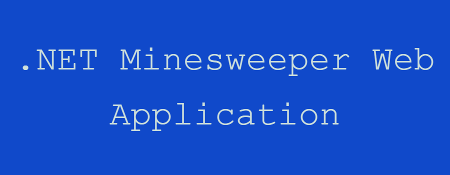

This repository contains a Minesweeper game implemented in C#.

## Table of Contents

- [Features](#features)
- [Technologies Used](#technologies-used)
- [Setup](#setup)
- [How to Play](#how-to-play)

## Features

- **Classic Gameplay:** Experience the classic Minesweeper gameplay with a C# twist.
- **User-Friendly Interface:** Easy-to-use interface for smooth gameplay.
- **Scoring System:** Keep track of your scores and compete with friends.
- **Saving System:** Save your scores and progress.

## Technologies Used

- C#
- .NET Framework (or .NET Core)
- Visual Studio (or your preferred C# IDE)

## Setup

1. **Clone the repository:**

    ```bash
    git clone https://github.com/danthalomous/MinesweeperWebApp.git
    ```

2. **Navigate to the project directory:**

    ```bash
    cd MinesweeperWebApp
    ```

3. **Build and run the application:**

    Open the solution file (`Minesweeper.sln`) in Visual Studio or your preferred C# IDE, then build and run the project.

## How to Play

1. **Objective:**
   - The objective of the game is to clear the minefield without detonating any mines.

2. **Gameplay:**
   - Click on a cell to reveal it.
   - If the revealed cell contains a mine, you lose the game.
   - If the revealed cell is empty, it will display the number of adjacent mines.
   - Use this information to strategically flag cells you suspect to contain mines.

3. **Controls:**
   - Left-click: Reveal a cell.
   - Right-click: Flag or unflag a cell as a potential mine.

4. **Winning:**
   - You win the game when all non-mine cells are revealed.

5. **Scoring:**
   - Your score is based on the time taken to complete the game and the grid size.

